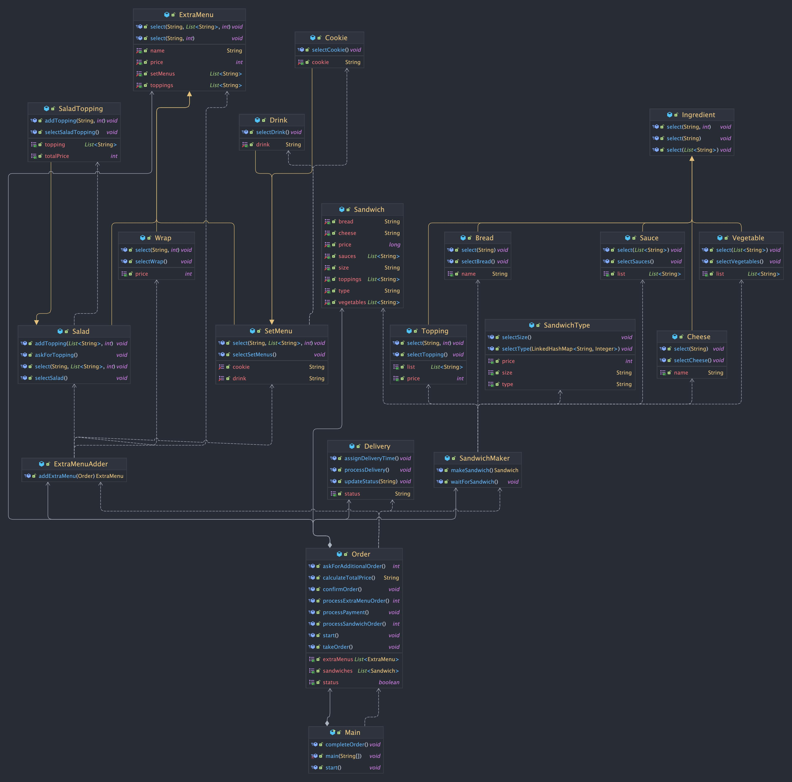

## 서브웨이 배달 주문 프로그램

KCS CLI program for Subway delivery order

### 프로그램 설명

- 서브웨이 샌드위치 주문을 위한 CLI 프로그램
- 샌드위치 종류, 크기, 빵, 치즈, 추가 토핑, 야채, 소스, 추가 메뉴 선택 가능
- 랩, 샐러드, 쿠키 세트 메뉴 선택 가능

### 파일 구조

```
.
└── subway
    ├── Main.java
    ├── delivery
    │   └── Delivery.java
    ├── extraMenu
    │   ├── ExtraMenu.java
    │   ├── ExtraMenuAdder.java
    │   └── menus
    │       ├── Cookie.java
    │       ├── Drink.java
    │       ├── Salad.java
    │       ├── SaladTopping.java
    │       ├── SetMenu.java
    │       └── Wrap.java
    ├── order
    │   └── Order.java
    └── sandwich
        ├── Sandwich.java
        ├── SandwichMaker.java
        ├── ingredients
        │   ├── Bread.java
        │   ├── Cheese.java
        │   ├── Ingredient.java
        │   ├── Sauce.java
        │   ├── Topping.java
        │   └── Vegetable.java
        └── type
            └── SandwichType.java
```

### 클래스 다이어그램



### 유저 시나리오

1. 프로그램을 실행한다.
2. 환영 문구를 보며 주문을 시작할지 선택한다.
    1. 주문을 시작하지 않으면 프로그램이 종료된다.
    2. 주문을 시작하면 `3`으로 이동한다.
3. 샌드위치와 추가메뉴 중 하나를 선택한다.
    1. 샌드위치 주문을 선택한다.
        1. 샌드위치 크기를 선택한다.
        2. 샌드위치 종류를 선택한다.
        3. 빵을 선택한다.
        4. 치즈를 선택한다.
        5. 추가 토핑을 선택한다.
        6. 야채를 선택한다.
        7. 소스를 선택한다.
    2. 추가메뉴 주문을 선택한다.
        1. 추가메뉴 종류를 선택한다.
        2. 추가메뉴를 선택한다.
4. 주문을 완료하고, 추가 주문을 진행할지 선택한다.
    1. 추가 주문 - `샌드위치`를 선택하면 `3-1`으로 이동한다.
    2. 추가 주문 - `추가 메뉴`를 선택하면 `3-2`로 이동한다.
    3. `주문 종료`를 선택하면 `5`로 이동한다.
5. 결제 예정 금액을 확인하고, 결제를 진행할지 선택한다.
    1. 결제를 진행하면 `7`으로 이동한다.
    2. 결제를 진행하지 않으면 프로그램이 종료된다.
6. 결제 수단을 선택하고, 결제를 진행한다.
7. 결제가 완료되면, 샌드위치 조리를 기다린다.
8. 샌드위치가 완성되면, 배달 정보를 입력한다.
9. 배달을 기다린다.
10. 배달이 완료되면, 주문 내역을 확인하며 프로그램을 종료한다.

### 실행 영상

#### [실행 영상](https://github.com/100-hours-a-week/5-jamie-java-cli/assets/78146904/92e0da1d-06e7-46cc-a226-4682a60da03c)

